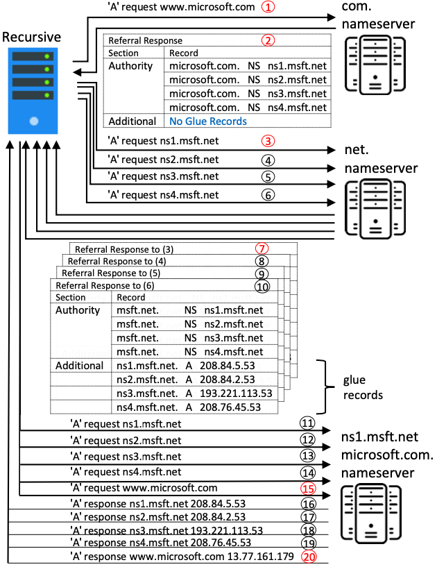

# A Formal Framework for End-to-End DNS Resolution

A Maude formalization of the DNS specification, attacker models for DoS attacks on DNS, a library of correctness/performance properties and automatization of attacks with model resolvers.


## File Overview
There are two variants of the model: a probabilistic and a non-deterministic one. Some modules are shared between both models.

- `src` contains our Maude files for the DNS models:
  - `common` contains modules shared by both variants of the model:
    - `actor.maude` defines basic actor and message data structures
    - `prelim.maude` introduces our basic types and actor roles (e.g., clients and resolvers)
    - `aux.maude` defines auxiliary functions
    - `parameters.maude` defines configuration parameters such as the query limit
    - `label_graph.maude` contains an implementation of GRoot's query EC generation algorithm in Maude
  - `nondet-model` contains the non-deterministic model:
    - `aux.maude` defines auxiliary functions specific to the non-deterministic model
    - `dns.maude` contains the rewrite rules for the non-deterministic DNS model
    - `properties.maude` defines properties that can be analyzed using the non-deterministic model
  - `probabilistic-model` contains the probabilistic version of the model
    - `apmaude.maude` defines basic infrastructure for the probabilistic model (e.g., a scheduler for communication)
    - `sampler.maude` defines various probability distributions
    - `aux.maude` defines auxiliary functions specific to the probabilistic model
    - `dns.maude` contains the rewrite rules for the probabilistic DNS model
    - `properties.maude` defines properties that can be analyzed using the probabilistic model
    - `parameters.maude` defines configuration parameters specific to the probabilistic model (e.g., message delays)
    - `pvesta_*.maude` are example scenarios for analysis with PVeStA. They are located in the source folder because this is required by PVeStA.
- `test` contains unit tests, end-to-end resolution tests, and some helper functions for the test cases
  - `test_helpers.maude` contains auxiliary functions used in the test cases
  - `example_nxns.maude` contains the example resolution from the NXNS paper ([illustration](doc/example_nxns.png))
  - `*_test.maude` files contain test cases that can be run using `test.py` (see below).
- `attacks` contains Maude files with initial configurations for reproducing various "single-query" versions of DoS attacks (this folder is to some extent superseded by the examples in `attacker-models`)
- `attacker-models` contains the (generalized) attacker models and examples how they can be used
  - `attacker.maude` contains the attacker models, e.g., a malicious NXNS nameserver or an iDNS nameserver
  - `examples/*` contains examples how the attacker models can be used (only for probabilistic model)
- `quatex-properties` contains QuaTEx definitions for statistical model checking
- `model-checking` contains property definitions and examples for (LTL) model checking
  - `preds.maude` contains the property definitions (note that these are simple wrappers for the properties in `src/**/properties.maude`)
  - All other files are examples
- `attack-exploration/src` contains the Python implementation of the attack discovery approach
  - `attack_exploration.py` is the main entry point
	- `attack_exploration/*_config` contain the type of configurations collected along the attack discovery
- `attacks_vs_model_resolvers` contains the Python code and implementation for running the attacks with different parameters and model resolvers. The results are also located here
  - `attack_validation` contains Maude files for testing DNS against 2 types of referral chain (lame and glueless) 
  - `ccv`,`ccv-delay`,`ccv-qmin`,`ccv-qmin-delay`,`idns`,`sub-ccv`,`sub-ccv-delay`,`sub-ccv-qmin-a`,`sub-ccv-qmin-a-delay`,`sub-dcv`,`sub-dcv-delay`,`sub-dcv-qmin-a`,`sub-unchained-cname`,`sub-unchained-dname`,`unchained-cname` and `unchained-cname-qmin` are the attack folders where the generated files and results are located. Two folders (`qmin-enabled` and `qmin-disabled`) distinguish the attacks with QMIN enabled or disabled.
   
   - `create_ccv_files.py` can launch the 'CNAME Scrubbing', 'CNAME Scrubbing + QMIN' attacks, and those two with delayed nameservers
   - `create_idns_files.py` launches 3 iDNS attacks
   - `create_sub_ccv_files.py` can launch the 'Parallel NS + Scrubbing + CNAME', 'Parallel NS + Scrubbing + CNAME+ QMIN' attacks, and those two with delayed nameservers
   - `create_sub_ccv_qmin_files.py` launches the 'Parallel NS + Scrubbing + CNAME' attack
   - `create_sub_cname_files.py` launches the 'Parallel NS + Unchained + CNAME' attack
   - `create_sub_dcv_files.py` launches the 'Parallel NS + Scrubbing + DNAME' attack and the same attack with delayed nameserver
   - `create_sub_dcv_qmin_files.py` launches the 'Parallel NS + Scrubbing + DNAME + QMIN' attack
   - `create_sub_dname_files.py` launches the 'Parallel NS + Unchained + DNAME' attack
   - `create_unchained_cname_files.py` launches the 'Unchained' attack. Two variants exist : one exploiting QMIN and the other ones that does not.
   - `model_attack_file.py` contains the model of attacks 
   - `model_resolver.py` contains the different model of resolvers
   
   - `*plot*.py` correspond to all the files that can be used to create plots of the different attack results, depending on the objective of the plots
   - `utils.py` contains most of the essential to create the different attacks, zones, entities and others
   - `watcher.py` contains an object checking that an attack is not repeated with the exact same parameters
   - `run_commands.sh` can be run the files that create and launch the attacks. Changes in attacks and resolvers should be done directly in the files.
   
   
## Requirements

- The model has been tested using [Maude](http://maude.cs.illinois.edu/w/index.php/The_Maude_System) versions 2.7.1 and 3.2.1.
- For statistical model checking:
  - Maude version **2.7.1** (newer versions are not compatible with PVeStA!)
  - [PVeStA](http://maude.cs.uiuc.edu/tools/pvesta/index.html)
  - Java 8 (newer versions are not compatible with PVeStA!)
  - Maude added to `PATH` and accessible from anywhere using `maude`.
- For simulation/search/LTL model checking:
  - Maude version 2.7.1 or 3.2.1
  - Environment variable `MAUDE_LIB` should point to the Maude folder (containing the file `model-checker.maude`).

## Test Cases

### Install Python dependencies

```shell
python3 -m venv .venv
source .venv/bin/activate
pip install -r requirements.txt
```

### Run the tests

To run a single test file (e.g., `test/common/aux_test.maude`):

```shell
./test.py --name common/aux_test --verbose
```
Note that the `.maude` suffix is omitted in the `--name` argument.

## Resolution Example

To simulate the model for the example from the [NXNS paper](https://www.usenix.org/conference/usenixsecurity20/presentation/afek) (see illustration below), use either one of the following, depending on the variant of the model to use:

```shell
maude test/probabilistic-model/example_nxns.maude

maude test/nondet-model/example_nxns.maude
```



## Tracing of Rewrite Rules
- Enable tracing in the Maude file (tracing of `rl` suffices):
  ```
  set trace on .

  set trace condition off .
  set trace whole off .
  set trace substitution off .
  set trace mb off .
  set trace eq off .
  set trace rl on . --- on
  set trace select off .
  set trace rewrite off .
  set trace body off .
  set trace builtin off .
  ```
- Execute the model and store output in a file, e.g.,
  ```
  maude test/probabilistic-model/example_nxns.maude > tmp.txt
  ```
- Use `trace.py` to extract the names of the rewrite rules that were applied:
  ```
  ./trace.py --infile tmp.txt --outfile rule_trace.txt
  ```
  
## Launch attacks against model resolvers
 In the folder `attacks_vs_model_resolvers`, the files starting with "create_..." can trigger attacks. This will create and execute generated Maude files, and collect the results.
 
### Example run
The following command can launch all the supported attacks of this project : 
```shell
./run_commands.sh
```
Note that we can change/add model resolvers and attacks in the files `model_resolver.py` and  `model_attack_file.py`: The new objects must then be added directly in all the "create_..." files so that the modified attacks can be launched against the modified model resolvers.
