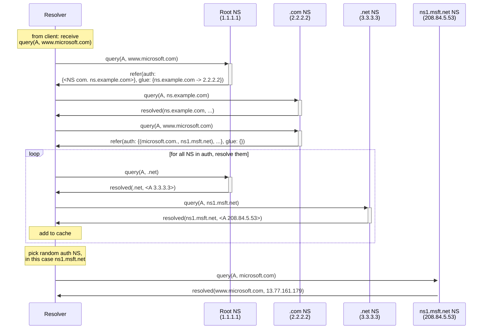
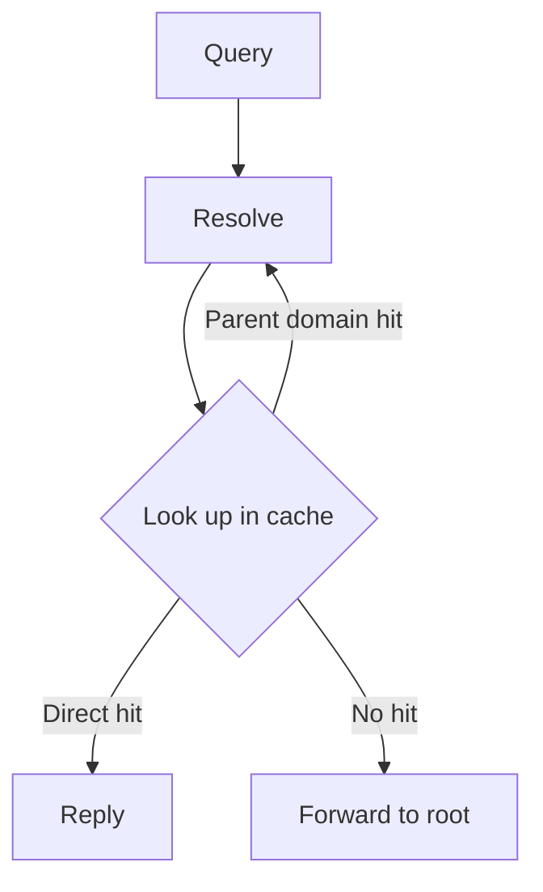

# Toy Example

_Note: This may be out of date!_

Based on [NXNS paper](https://www.usenix.org/conference/usenixsecurity20/presentation/afek).

Assumptions:

- All participants start with an empty cache.

Based on this, we can derive the following flow chart:

